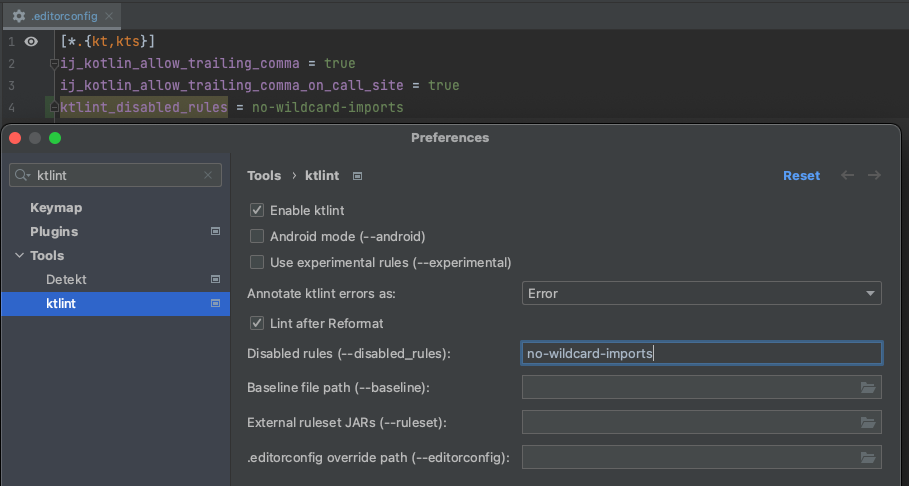

# `pulumi-kotlin`

## Pull requests

Creation of PRs should happen with use of [dedicated template][pulumi-kotlin-github-pull-request-template].  
GitHub will automatically use this template when one creates PR.

Marking PR as _ready for review_ will notify [CODEOWNERS][pulumi-kotlin-github-codeowners]  
and will trigger checks running tests and verifying code.

CODEOWNERS' reviews are required in order to merge PR to branch `main`.

## Releasing

All schema versions used for releasing the libraries are configured in the `src/main/resources/version-config.json`
file. There are two release paths:

1. If you want to update provider schemas and build new versions of the libraries, run the Gradle
   task `prepareReleaseOfUpdatedSchemas`.
2. If you want to release a new version of all libraries due to some update in the generator (i.e. the `pulumi-kotlin`
   codebase), run the Gradle task `prepareReleaseAfterGeneratorUpdate`.

These tasks will create a new commit which updates the versions in `version-config.json` accordingly. Push this commit
out to a new branch and create a PR (like [this one][pulumi-kotlin-github-version-update-pr]). Once this
PR is approved and merged, a GitHub Action will be triggered
(like [this one][pulumi-kotlin-github-release-action]), which will:

1. Tag the merge commit with the appropriate release versions.
2. Release the requested libraries to the
   [Maven registry (hosted on GitHub)][github-docs-maven-registry].
   The released libraries will be visible in the
   [Packages] section on GitHub.
3. Fast-forward the released versions to SNAPSHOT versions and create a PR
   (like [this one][pulumi-kotlin-packages]). Once this PR is approved and merged, the
   release cycle is complete.

In the future, the task `prepareReleaseOfUpdatedSchemas` could be run automatically as a cron job. For now, it will need
to be run manually by one of the team members.

## Development standards

It is recommended to use modern IDE [IntelliJ IDEA][intellij-idea] for development purposes.

### Formatter

The shared IntelliJ formatter config can be found in `.idea/codeStyles/Project.xml`. It has been adjusted to be as
compatible as possible with the plugins described in the following section. It can be triggered with the `⌘⌥L` keyboard
shortcut (or `Ctrl+Alt+L` on Windows/Linux).

### Static code analysis

Two plugins are included in our Kotlin projects: [Ktlint][gradle-plugin-kotlin]
and [Detekt][detekt]. Both need to pass for a pull request to be accepted.  
⚠️ Note: **For the time being, the pre-existing Detekt warnings are being ignored.**

#### Detekt

* detects code smells
* can be run with the `detekt` Gradle task
* TXT, HTML, and Markdown reports are stored in `build/reports/detekt`
* custom configuration can be placed in the `.detekt-config.yml` file
* to suppress a rule, use the `@Suppress` annotation (e.g. `@Suppress("EnumNaming")`)
* it can be integrated with IntelliJ using the [Detekt][intellij-plugin-detekt] plugin
    * note that the plugin does not pick up on custom configuration files by default, so you have to point it to the
      appropriate path manually
      

#### Ktlint

* provides linting and formatting
* to verify if everything is formatted correctly, run the `lintKotlin` Gradle task
* to fix formatting errors, run the `formatKotlin` Gradle task (note that some
  errors cannot be fixed automatically and have to be handled manually)
* TXT and HTML reports are stored in `build/reports/ktlint`
* follows the custom configuration placed in `.editorconfig`
* to suppress a rule, use the `@Suppress` annotation and prefix the rule name with "ktlint" (
  e.g. `@Suppress("ktlint:enum-entry-name-case")`)
* it can be integrated with IntelliJ using the [Ktlint (unofficial)][intellij-plugin-ktlint]
  plugin
    * this plugin picks up on the settings placed in the `.editorconfig` file, but it does not recognize
      the `ktlint_disabled_rules` parameter - therefore, any disabled rules have to be configured manually in the
      plugin's settings
      
    * this IntelliJ plugin relies on a different Ktlint Gradle plugin than our projects and therefore the underlying
      Ktlint version might differ (for example, as of September 2022, the Gradle plugin is using version 0.47.1 and the
      IntelliJ plugin is using version 0.46.1) - **always primarily rely on the Gradle plugin**

### Code style

Following the guidelines listed here will also allow to maintain the consistency of the code.

#### Explicit function return types

Don't specify the return type for simple, one-line functions.

Do it for the complex functions (try to use braces and return then), or in cases where type inference is not possible.

Do:
```kotlin
private fun getKDoc(resource: SchemaModel.Resource) = KDoc(resource.description, resource.deprecationMessage)
```

Do:
```kotlin
private fun createComplexTypeFields(
    property: ObjectProperty,
    context: Context,
    usageKind: UsageKind,
): Map<String, TypeAndOptionality> {
    return property.properties
        .map { (name, value) ->
            name.value to TypeAndOptionality(
                resolveNestedTypeReference(context, value, usageKind.toNested()),
                property.required.contains(name),
                getKDoc(value),
            )
        }
        .toMap()
}
```

Don't:
```kotlin
private fun getKDoc(resource: SchemaModel.Resource): KDoc = KDoc(resource.description, resource.deprecationMessage)
```

#### Explicit val types

Don't specify the type.

Name variables properly and use IntelliJ's type hints (screenshot below).

There are some exceptions where one can leverage type inference + type aliases to write a more readable code (see "Do (exception)" below).

Do:
```kotlin
val propertiesByNameWithContext = allPropertiesToBeFlattened
    .flatten()
    .toMap()
    .lowercaseKeys()
```

Do (exception):
```kotlin
val types: TypesMap = schema.decodeOne("types")
val functions: FunctionsMap = schema.decodeOne("functions")
val resources: ResourcesMap = schema.decodeOne("resources")
```

Don't:
```kotlin
val propertiesByNameWithContext: Map<NameWithContext, List<Property>> = allPropertiesToBeFlattened
     .flatten()
     .toMap()
     .lowercaseKeys()
```

[pulumi-kotlin-github-pull-request-template]: https://github.com/VirtuslabRnD/pulumi-kotlin/blob/main/.github/pull_request_template.md
[pulumi-kotlin-github-codeowners]: https://github.com/VirtuslabRnD/pulumi-kotlin/blob/main/.github/CODEOWNERS

[pulumi-kotlin-github-version-update-pr]: https://github.com/VirtuslabRnD/pulumi-kotlin/pull/98
[pulumi-kotlin-github-release-action]: https://github.com/VirtuslabRnD/pulumi-kotlin/actions/runs/3328060887

[github-docs-maven-registry]: https://docs.github.com/en/packages/working-with-a-github-packages-registry/working-with-the-apache-maven-registry

[pulumi-kotlin-packages]: https://github.com/orgs/VirtuslabRnD/packages?repo_name=pulumi-kotlin

[intellij-idea]: https://www.jetbrains.com/idea/

[gradle-plugin-kotlin]: https://github.com/jeremymailen/kotlinter-gradle

[detekt]: https://github.com/detekt/detekt

[intellij-plugin-detekt]: https://plugins.jetbrains.com/plugin/10761-detekt

[intellij-plugin-ktlint]: https://plugins.jetbrains.com/plugin/15057-ktlint-unofficial-